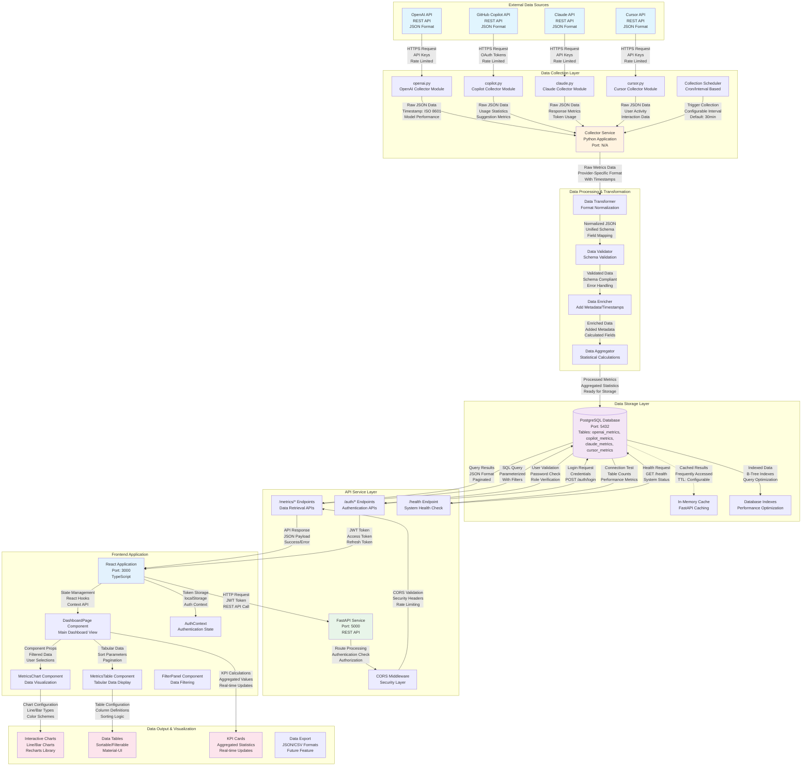

# AI Organization Dashboard - Comprehensive Data Flow Diagram

## Overview

This document provides a detailed, step-by-step data flow diagram illustrating the complete data lifecycle within the AI Organization Dashboard system, from data ingestion to visualization.

## Data Flow Architecture



## Detailed Data Flow Stages

### 1. Data Sources and Entry Points

**External APIs:**
- **OpenAI API**: Provides GPT model usage metrics, token consumption, and cost data
- **GitHub Copilot API**: Delivers code suggestion metrics, acceptance rates, and user activity
- **Claude API**: Supplies response metrics, model performance, and usage statistics
- **Cursor API**: Offers editor interaction data, user engagement, and feature usage metrics

**Data Formats:**
- All external APIs return JSON-formatted data
- Timestamps follow ISO 8601 standard
- Rate limiting enforced by API providers
- Authentication via API keys or OAuth tokens

### 2. Data Processing Stages with Transformations

**Collection Phase:**
```
External API → Collector Module → Raw JSON Data
```

**Transformation Phase:**
```
Raw Data → Field Mapping → Schema Normalization → Unified Format
```

**Validation Phase:**
```
Transformed Data → Schema Validation → Type Checking → Error Handling
```

**Enrichment Phase:**
```
Validated Data → Metadata Addition → Calculated Fields → Timestamps
```

**Aggregation Phase:**
```
Enriched Data → Statistical Calculations → Summary Metrics → Ready for Storage
```

### 3. Storage Locations and Data Persistence

**Primary Storage:**
- **PostgreSQL Database** with separate tables for each AI service
- **Indexed columns** for optimal query performance (timestamp, application_id)
- **JSONB fields** for flexible metadata storage
- **Unified view** for cross-platform reporting

**Caching Layer:**
- **In-memory caching** for frequently accessed data
- **Configurable TTL** for cache expiration
- **Cache invalidation** on data updates

### 4. Data Outputs and Destinations

**API Responses:**
- **JSON format** with consistent response structure
- **Paginated results** for large datasets
- **Filtering and sorting** capabilities
- **Error handling** with descriptive messages

**Frontend Visualizations:**
- **Interactive charts** using Recharts library
- **Sortable tables** with Material-UI components
- **Real-time updates** via React state management
- **Responsive design** for multiple screen sizes

### 5. Key Decision Points and Conditional Flows

**Collection Decision Tree:**
```
Schedule Trigger → Check API Availability → Validate Credentials → Collect Data → Handle Errors → Retry Logic
```

**Authentication Flow:**
```
User Login → Credential Validation → Role Check → Generate JWT → Store Token → Authorize Requests
```

**Data Validation Flow:**
```
Incoming Data → Schema Check → Type Validation → Range Check → Error Logging → Reject/Accept
```

**Error Handling Flow:**
```
API Error → Log Error → Return Error Response → Display User-Friendly Message → Suggest Resolution
```

## Critical Paths and Potential Bottlenecks

### Critical Paths:
1. **Real-time Data Collection**: External API calls must complete within scheduled intervals
2. **Database Queries**: Optimized indexes ensure fast data retrieval
3. **Authentication**: JWT validation must be performant for every API request
4. **Frontend Rendering**: Chart and table components must handle large datasets efficiently

### Potential Bottlenecks:
1. **External API Rate Limits**: May delay data collection if limits are exceeded
2. **Database Connection Pool**: Could become saturated under high load
3. **Large Dataset Processing**: Unfiltered queries returning thousands of records
4. **Memory Usage**: Frontend caching of large datasets in browser memory

## Data Formats and Protocols

### API Communication:
- **Protocol**: HTTPS (TLS 1.3)
- **Format**: JSON (application/json)
- **Authentication**: JWT Bearer tokens
- **CORS**: Configured for cross-origin requests

### Database Communication:
- **Protocol**: PostgreSQL wire protocol
- **Connection Pooling**: Managed by connection pooler
- **Query Format**: Parameterized SQL queries
- **Transaction Management**: ACID compliance

### External API Integration:
- **Rate Limiting**: Respects provider limits
- **Retry Logic**: Exponential backoff on failures
- **Timeout Configuration**: 30-second default timeout
- **Error Handling**: Graceful degradation on failures

## Performance Optimization Strategies

1. **Database Indexing**: Strategic indexes on frequently queried columns
2. **Query Optimization**: Efficient SQL queries with proper JOINs and filters
3. **Caching Strategy**: Multi-level caching (database, API, frontend)
4. **Pagination**: Limited result sets for large queries
5. **Async Processing**: Non-blocking data collection and processing
6. **Connection Pooling**: Efficient database connection management

This comprehensive data flow diagram ensures clear understanding of how data moves through the AI Organization Dashboard system, enabling effective monitoring, optimization, and troubleshooting of the entire data pipeline.